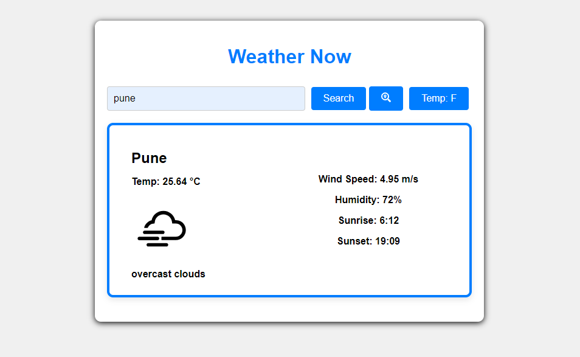

# WeatherNow
A react weather app with geolocation and a search engine to get weather reports of any city in the world.

## Technology Used

- OpenWeatherMap API
- Node.js as Backend
- React.js as Frontend
- Vercel for Deployment

## Live link
https://weathernow-eta.vercel.app/

## Screenshot

